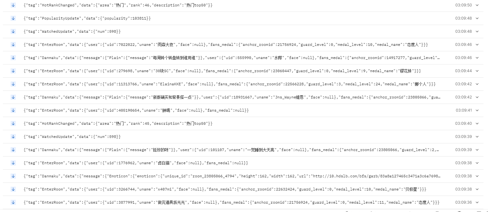

# rudanmaku-core
提供批量对bilibili直播间的监控服务
# 启动
- 使用配置启动： `rudanmaku-core config <config-path>`
- 单房间在localhost启动 `rudanmaku-core <roomid> <port?=10200>`
## 启动配置
配置是toml格式的，以下是一个例子
```toml
[net]
port = 10200
# 优先采用ipv4
ipv4 = [0,0,0,0]
# 如果没有ipv4，采用ipv6
ipv6 = [0,0,0,0,0,0,0,0]
# 如果都没有设置，默认采用ipv4 0.0.0.0

[[room]]
# 房间id长短都可以
roomid = 23840076
# channel 目前支持json|bincode
channel = ["json", "bincode"]

[[room]]
roomid = 5229
channel = ["json", "bincode"]
```


# 连接
地址 `ws://<ip>:<port>/<roomid>/<channel>`

如`ws://localhost:10200/477317922/json`
## json
示例如下

## JavaScript/TypeScript 支持
```bash
npm install bilive-danmaku-json@0.1.0-rc4
```
### 使用例
```TypeScript
import {Event, DanmakuEvent} from 'bilive-danmaku-json';
function on_danmaku(data: DanmakuEvent['data']) {
    if(data.junk_flag===0) {
        console.log(data.message);
    }
    // ...
}
// ... 获取data
const evt = JSON.parse(data);
if(evt.tag === 'Danmaku') {
    on_danmaku(evt.data);
}
```
## 事件类型
参见[这个仓库](https://github.com/4t145/bilive-danmaku)

## 关于bincode
bincode是二进制编码的数据结构，如果你对接此服务的应用是用rust编写的，bincode可能可以给你提供更高的正反序列化效率

对接端可以用本项目的依赖库`bilive-danmaku`，并启用`event`和`bincode`
```toml
[dependencies]
bilive-danmaku = {git = "https://github.com/4t145/bilive-danmaku", branch = "ver-0.1.0"， features = ["event", "bincode"]}
```
bincode详情请参见[此仓库](https://github.com/bincode-org/bincode)

# 自行编译可能遇到的问题
## 我从未使用过rust？
1. 根据官网指导安装rust工具链https://www.rust-lang.org/zh-CN
2. 安装`nightly`版本工具链: `rustup toolchain install nightly`
3. 在本文件夹内切换到nightly版本: `rustup override set nightly`
4. 编译发行版 `cargo build --release`
5. 编译完的可运行程序在`/target/release`中
## linux上NativeTLS相关？
我的评价是，直接google报错内容！
